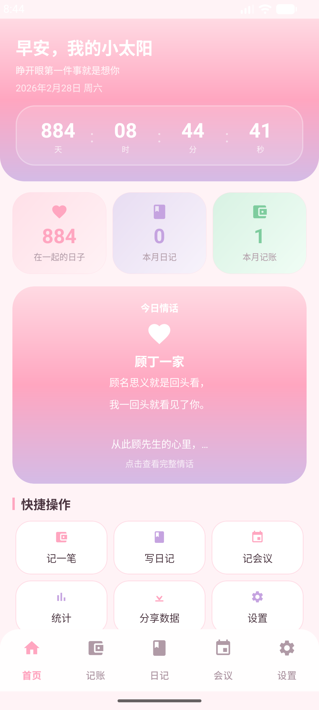
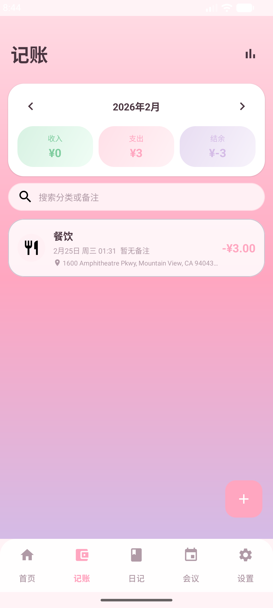
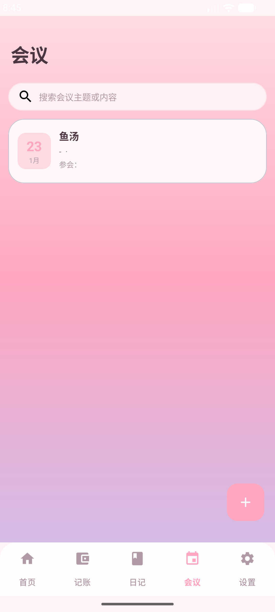
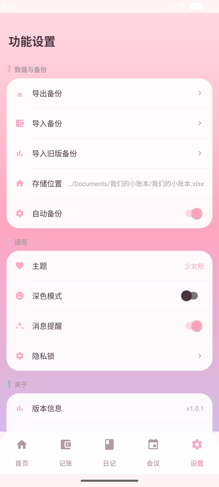

# 我们的小账本 💕

 


一款专为情侣设计的 Android 记账应用，用爱记录生活的点点滴滴。

## 功能特色

- 📒 **记账管理** — 支持收入/支出记录，多分类管理，按月统计
- 📖 **情侣日记** — 记录每天的心情、天气，共同书写爱的故事
- 📋 **会议纪要** — 记录重要的约定和决定
- 🎉 **彩蛋系统** — 隐藏了 25+ 个甜蜜互动彩蛋，等你发现
- 💌 **情书页面** — 藏在设置里的浪漫惊喜
- 📝 **草稿自动保存** — 2 秒防抖自动保存，不怕意外丢失

## 技术栈

| 项目 | 技术 |
|------|------|
| 语言 | Kotlin 1.9.22 |
| 架构 | MVVM + Jetpack Navigation |
| UI | XML + Material Design 3 |
| 数据存储 | Apache POI（Excel .xlsx） |
| 异步处理 | Kotlin Coroutines |
| 最低版本 | Android 8.0（API 26） |

## 项目结构

```
com.loveapp.accountbook
├── data/           # 数据层（ExcelRepository）
├── ui/
│   ├── home/       # 首页
│   ├── account/    # 记账模块（列表/添加/统计）
│   ├── diary/      # 日记模块（列表/添加）
│   ├── meeting/    # 会议纪要模块（列表/添加）
│   ├── settings/   # 设置页面
│   ├── adapter/    # RecyclerView 适配器
│   └── love/       # 情书页面
├── manager/        # DraftManager / EasterEggManager
└── utils/          # 工具类（DateUtils 等）
```

## 构建运行

```bash
# 构建 Debug APK
./gradlew assembleDebug

# 安装到设备
./gradlew installDebug

# 清理重建
./gradlew clean assembleDebug
```

## 数据说明

应用使用 Excel 文件（`我们的小账本.xlsx`）作为数据库，包含三个工作表：

- **记账** — 日期、类型、分类、金额、备注
- **日记** — 日期、天气、心情、标题、内容、图片
- **会议纪要** — 日期、标题、参与人、地点、内容等

数据文件存储在应用私有目录 `DataManager/` 下。

## 截图预览

<p align="center">
  
  
  
  
  
</p>

| 页面 | 功能说明 |
|:---:|---|
| **首页** | 在一起天数实时计时、今日情话、本月统计、快捷操作入口 |
| **记账** | 按月查看收支明细，支持分类搜索，一键添加记录 |
| **日记** | 心情日记列表，支持标签筛选（日常/美食/运动/购物/约会） |
| **会议** | 会议纪要管理，记录重要约定和决定 |
| **设置** | 数据备份导入导出、主题切换、深色模式、隐私锁 |

## 许可证

本项目仅供个人学习使用。
